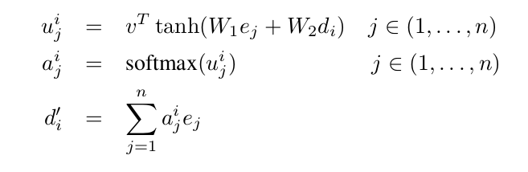
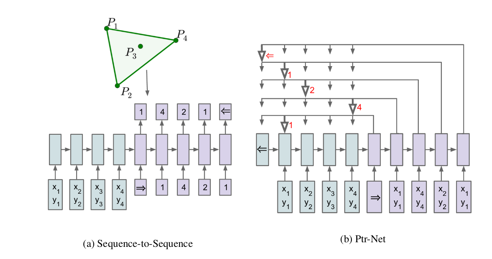
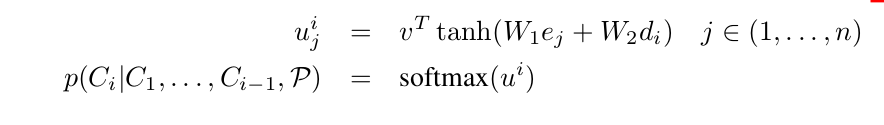

# Pointer Networks  
>Oriol Vinyals, Meire Fortunato, Navdeep Jaitly  

### Problem
- Recurrent Neural Networks (RNNs)  architecture limited them to settings where the inputs and outputs were available at a fixed frame rate. 
-  require the size of the output dictionary to be fixed a priori.
-  cannot directly apply this framework to **combinatorial problems** where the size of the output dictionary depends on the length of the input sequence

### Ideas

- *Sequence-to-Sequence Model*
  encoder-decoder  
- *Content Based Input Attention*
   
   where softmax normalizes the vector u i (of length n) to be the “attention” mask over the inputs,and v, W 1 , and W 2 are learnable parameters of the model

- **ptr-net**
   
   
   
  ***
   
